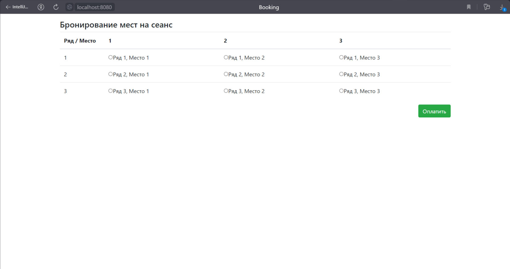
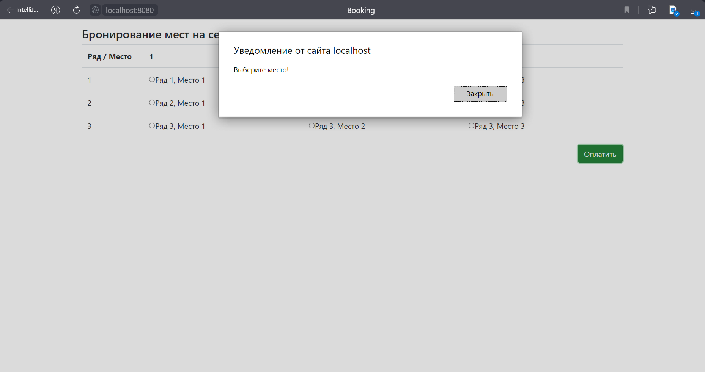
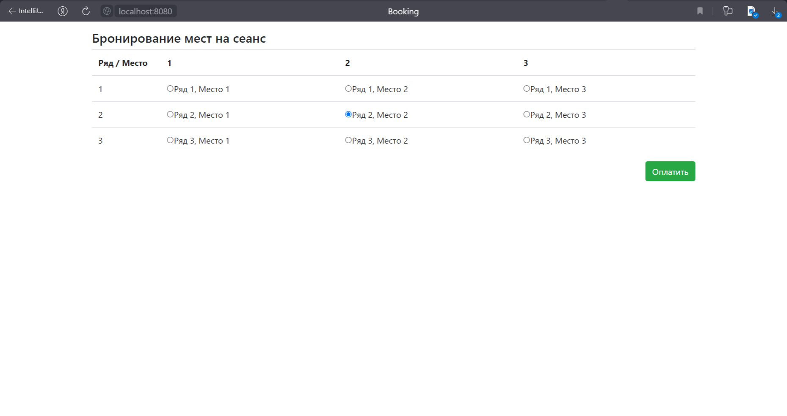
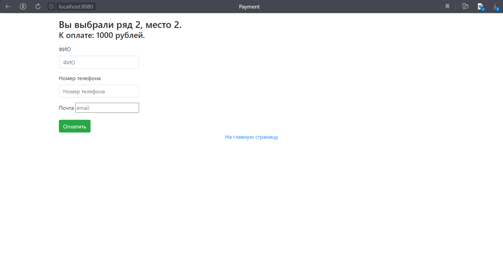
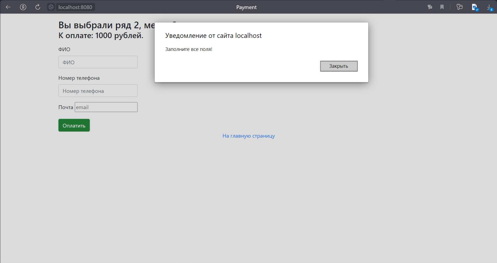
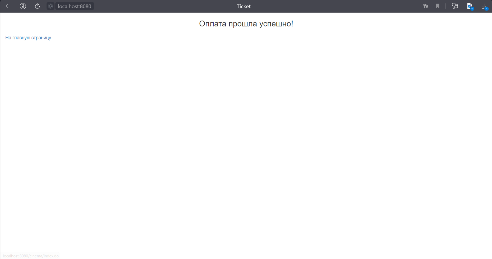
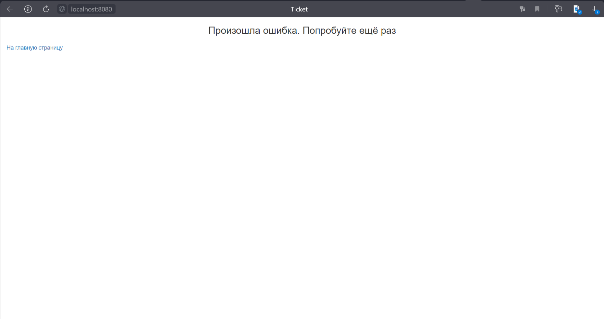
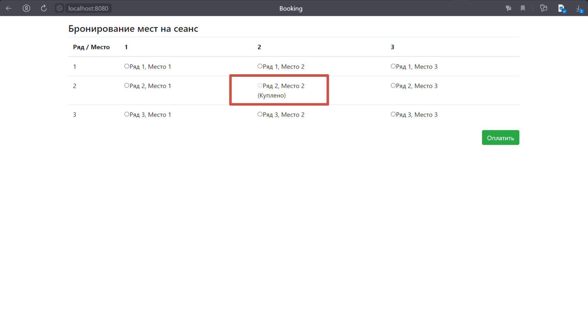

This repository presents an application for buying cinema tickets. The main page has a table showing all the seats in
the cinema:

A user needs to select a seat, or he will be alerted to select it:

If the user selects a seat,

he is redirected to the payment page, where he can view his row, cell and amount to be paid:

The user needs to fill all fields, otherwise he will be alerted to do it:

After filling the fields, the user needs to click on the button, and if everything is good, he is redirected to a
success page:

otherwise, he redirects to a fail page:

If the seat is bought successfully, it will not be available on the home page:

